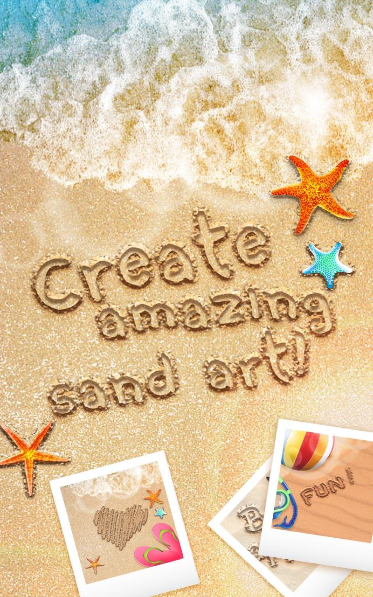
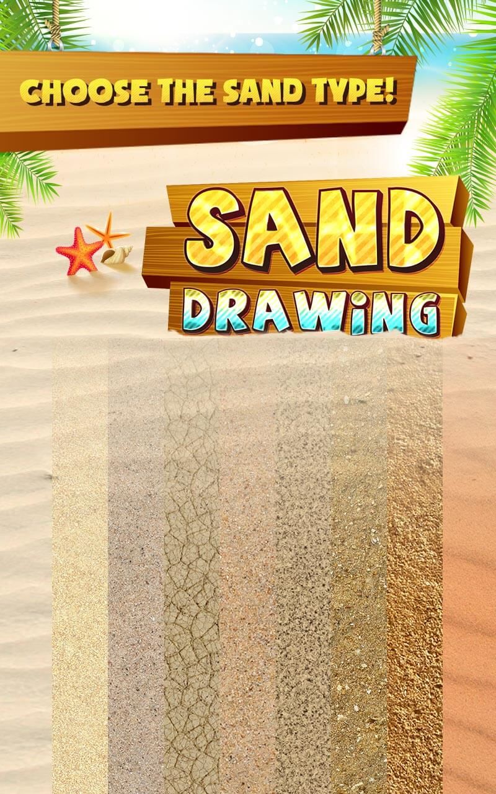
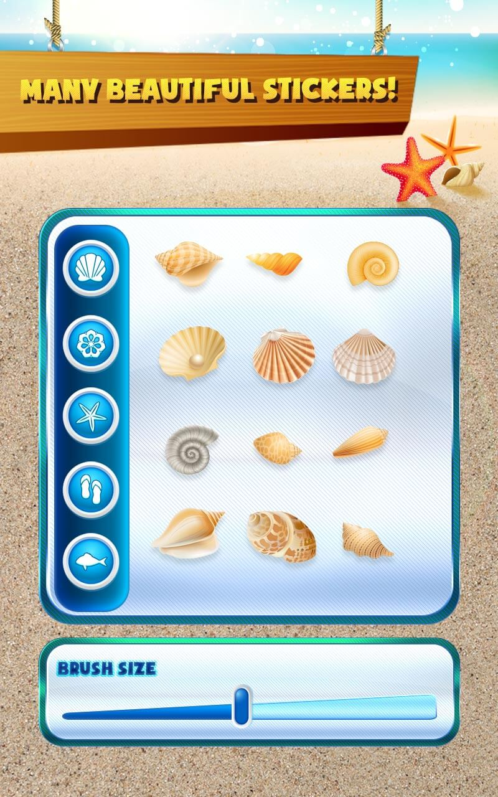
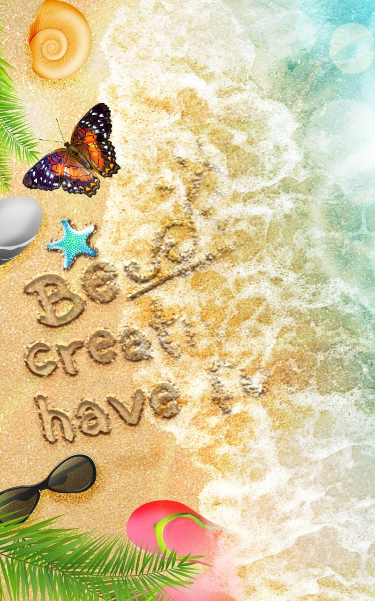

# Sand-Draw

  
  
  
  
  

## Features
  * Simple and intuitive interface! 
  * Many types of sand to use as a background for your drawings and doodles on sand! 
  * Choose different width of the stroke or alternate between thin and thick lines to draw stunning drawings in the sand!
  * Pick cute decorations such as seashells, pebbles, even fish, flowers and more!
  * Realistic sea waves wipe away your drawing once you’re finished! Don’t forget to save your art on sand before you wash it away! Create a drawing book of your sand drawings and show everyone your artistic skills! 

## [DOCUMENTATION](https://github.com/spatel210/Sand-Draw/blob/main/SandDraw.pdf)
